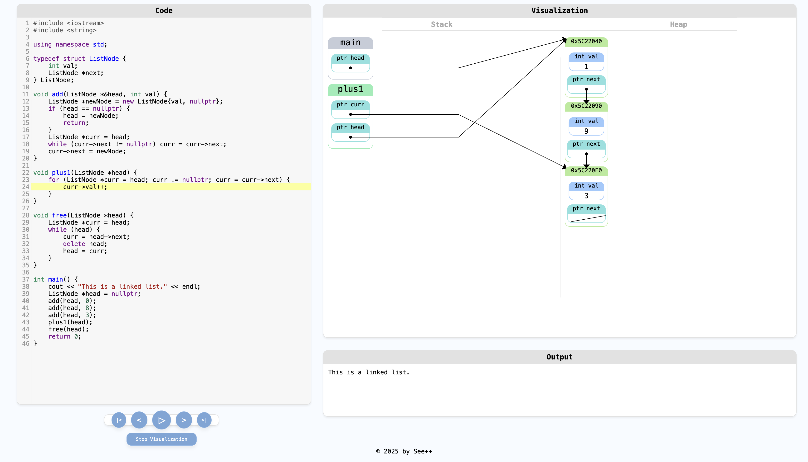
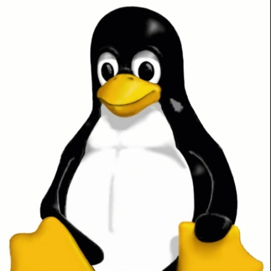

# See++

  

  
  
  
  

## A C++ Visualization Tool
See++ is a tool for visualizing and debugging C++ code aimed at helping students, educators, and developers understand what their code is actually doing. It takes C++ code and shows a step-by-step execution trace including stack frames, heap memory, and variable values.

<a href="https://seepluspl.us">
  

    
  

</a>

## Getting Started

### Try It Now
1. Visualize your code at [seepluspl.us](https://seepluspl.us), no setup required.

> ⚠️ **Note**: We're aware that the site currently takes ~1m to run code. This is due to a recent change to improve the security of the service, and this is our top priority to improve.

### Run Locally
1. Clone the repo via `git clone https://github.com/knazir/SeePlusPlus.git`.
2. Download and install [Docker Desktop](https://www.docker.com/products/docker-desktop/).
3. Copy `.env.example` to `.env`.
4. Run `./localdev.sh` from the root `SeePlusPlus/` directory.
5. Visit `http://localhost:8000` in your browser and start visualizing your code.

### Deploy Your Own
1. Clone the repo via `git clone https://github.com/knazir/SeePlusPlus.git`.
2. Download and install [Docker Desktop](https://www.docker.com/products/docker-desktop/).
3. Follow the instructions in the [wiki](https://github.com/knazir/SeePlusPlus/wiki) to configure and deploy the app via the AWS CLI.

## Project Goals
|                        |                                                                                                           |
| ---------------------- | --------------------------------------------------------------------------------------------------------- |
| **Education**          | Demystify program flow, pointers, recursion, and memory models in C++.                                    |
| **Developer Friendly** | Provide a fast alternative when you just need a quick mental model check.                                 |
| **Zero Setup**         | Run interface entirely in-browser. No compiler, IDE, or configuration needed. Just write and run.         |
| **Safety**             | Allow users to run code in an isolated sandbox without worrying about the impact to others.               |
| **Open & Extensible**  | Fully open source, including the infrastructure required to deploy your own service.                      |

## Features
| Feature                         | Description                                                                                      |
| ------------------------------- | ------------------------------------------------------------------------------------------------ |
| **Step Through Execution**      | Step forward or backward through each program state.                                             |
| **Timeline Scrubbing**          | Drag the timeline slider to navigate across steps instantly.                                     |
| **Line Number Jumping**         | Click a line to jump to its next execution point. Click repeatedly to skip forward through hits. |
| **Play Mode**                   | Animate your code execution with an auto-playing visual trace.                                   |
| **Stack Frame Viewer**          | Visualize the full call stack and active stack frames over time.                                 |
| **Variable Inspector**          | See values of all local and stack variables at each step.                                        |
| **Heap Memory View**            | Explore heap allocations with automatic object grouping.                                         |
| **Orphaned Memory Detection**   | Highlight heap blocks with no live references (e.g. leaks).                                      |
| **Pointer/Reference Tracing**   | Follow pointers and references across stack and heap with directional arrows.                    |
| **Automatic Layout**            | Smart auto-layout for stack and heap to reduce visual clutter.                                   |

## Endorsements
> Many students struggle to build a proper mental model of what their code is doing. Tools like See++ that visualize memory, state, and control flow are incredibly valuable — especially for recursion and data structures.
>
> I’m very excited about this project and can’t wait to show it to my students.
>
> — Marty Stepp, Lecturer, Stanford University (CS106A/B/X)

## Origins
See++ began as a response to one of the most common struggles in computer science education: helping students understand how C++ code interacts with memory. Seeing the recurring challenges students face with recursion, pointers, and the call stack, See++ was first developed as a [CS194](https://web.stanford.edu/class/cs194/) capstone project at Stanford University by a group of teaching assistants. The project was inspired by the observation that drawing program-flow diagrams on a whiteboard was one of the most effective methods to help students understand code. However, these exercises were time-consuming for more complex problems and didn't scale well as they required TAs to manually draw diagrams step-by-step with students "in the room."

The project was originally designed to support [CS106B: Programming Abstractions](https://web.stanford.edu/class/cs106b/) students at Stanford, who often found it difficult to visualize dynamic memory, recursive calls, and pointer-based data structures like linked lists and trees in C++.

The original design was **incredibly** insecure, running untrusted user code directly on an AWS EC2 instance. As expected of a college project, this was left to fester without much consideration. As the maintainers slowly came to their senses over the years, they realized what a terrible, terrible idea it was to keep the service running with no safeguards. To address this, the project was taken offline in March 2025 for a large-scale rewrite to make it more scalable and secure.

The initial rewrite was completed in July 2025 that moved the system from running on a single EC2 instance to a containerized, more-scalable app deployed to AWS and running untrusted user code in isolated sandboxes. This has led to its own share of issues, namely the large slowdown of running code due to spinning up and tearing down the sandboxed containers. While this is the number one priority currently being looked at (see Roadmap), the site is at least back up now, with program runs taking on the order of ~1-2 minutes to complete (way too slow!).

Today, See++ aims to serve not only students and instructors, but anyone who needs a fast, visual model of C++ code in action.

## 🗺️ Roadmap
Ordered from highest to lowest priority.
- [ ] Speed up code execution in deployed environments (currently ~1m for simple programs)
- [ ] Add linting for more consistent style and easier contribution
- [ ] Create GitHub Issue/PR templates
- [ ] Create CONTRIBUTING.md and CLA for contributions
- [ ] Create deployment and architecture guides in Wiki
- [ ] Rewrite original 2018 frontend to be more robust, extensible, and use modern web patterns
- [ ] Setup GitHub actions for automated deployment
- [ ] Add test suite for each service and modified Valgrind
- [ ] Add smart assist features to help better understand your code and flow
- [ ] Add support for other languages (C, Python, JavaScript, and more)

## Contributing
We welcome PRs and issue reports of all sizes! We're still getting a `CONTRIBUTING.md` guide and contributor license agreement setup, but feel free to explore the project and experiment in the meantime.

## Acknowledgements
This project is based on the modifications made by [@pgbovine](https://github.com/pgbovine) to Valgrind to trace C++ program execution. These modifications and the work on top of them can be found in our linked repo [SPP-Valgrind](https://github.com/knazir/SPP-Valgrind). This project is licensed under GPL-2.0 as a derivative work.

## Maintainers
Please direct all quips, qualms, and conundrums to:

<table>
  <tr>
    <td align="center">
      <a href="https://github.com/knazir">
         
        <b>Kashif Nazir</b>
      </a>
    </td>
  </tr>
</table>

## Contributors
Many thanks to these wonderful people:

<table>
  <tr>
    <td align="center">
      <a href="https://github.com/ataylor4">
         
        <b>Ashley Taylor</b>
      </a>
    </td>
    <td align="center">
      <a href="https://github.com/knazir">
         
        <b>Kashif Nazir</b>
      </a>
    </td>
    <td align="center">
      <a href="https://github.com/ruechy">
         
        <b>Lucy Wang</b>
      </a>
    </td>
    <td align="center">
      <a href="https://github.com/mariamyang">
         
        <b>Maria Yang</b>
      </a>
    </td>
    <td align="center">
      <a href="https://github.com/seally1186">
         
        <b>Michael Chang</b>
      </a>
    </td>
  </tr>
</table>

